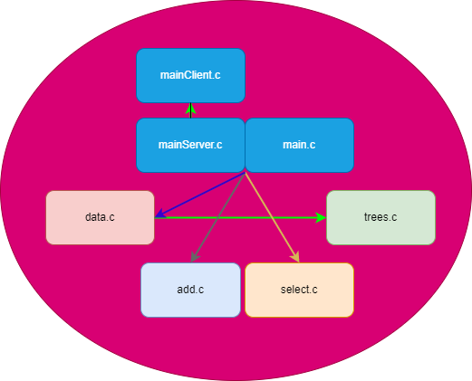

## Customer Management System
A program to manage customer information, implemented as a client-server application. The program uses socket programming to communicate between the client and the server.

# Features

- Set: The program allows the user to add new customers to the customer database.

- Select: The program allows the user to select customers based on certain criteria, such as debt, date, etc.

- Print: The program allows the user to print all customer information in debt order.

# File Descriptions

- main.c: This file contains the main function of the program, which starts the server and handles incoming client connections.

- data.c: This file contains functions related to reading and writing customer information to a file.

- select.c: This file contains functions related to selecting customers based on certain criteria.

- add.c: This file contains functions related to adding new customers to the customer database.

# Implementation Details
The program uses a binary search tree to store customer information. Each customer is stored as a node in the tree, with different trees being used to store customers based on different criteria (e.g. debt, date, etc.). The program uses socket programming to communicate between the client and the server. The server listens for incoming client connections and starts a separate thread for each client to handle the client's commands.
